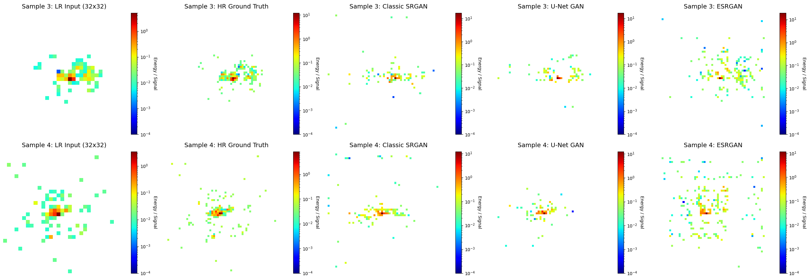

# Super Resolution using Generative Adversarial Networks
This repository contains the implementation of a Generative Adversarial Network (GAN) designed to perform super-resolution on high-energy physics data. Specifically, the model enhances low-resolution calorimeter energy deposits (jets) into high-resolution images.
## Task Overview
**Objective:** Train a Generative Adversarial Network to map low-resolution jet images of calorimeter deposits (X_jets_LR) to their high-resolution counterparts (X_jets).
- **Input Data:** Low-resolution matrices (X_jets_LR)
- **Output Data:** High-resolution 125x125 three-channel image matrices (X_jets)
- **Core Task:** Train a Generative Adversarial Network (GAN) to map the low-resolution inputs to the high-resolution space.
## Implementation Dtails
### Data Pre-processing
Calorimeter matrices are highly sparse and feature an extreme dynamic range of energy values. Training generative models directly on raw linear energy results in severe instability.
- **Log Transformation:** To stabilize the gradients and allow the networks to learn both the dense energy cores and the sparse shower peripheries, I applied a logarithmic transformation to the data: $E^′=log_{10}​(E+1)$.
- **Inverse Transformation:** All model outputs are inversely transformed $(E=10^{E^′}−1)$ before calculating physical benchmark metrics.
- **Sparsity Handling:** Addressed the dominance of zero-value pixels (empty detector space) by utilizing specialized activation boundaries to prevent the models from hallucinating background noise.
### Model Selection: Generative Adversarial Networks (GAN)
To fulfill the core requirement, I implemented Super-Resolution GANs tailored for physics data.
- **1. Generator Architecture:** I have implemented three different generator architecture - SRGAN, U-Net GAN and ESRGAN respectively, and evluate their comparative preformance.
  - Implemented SRGAN as the baseline generator, utilizing a deep residual network (ResNet) backbone coupled with sub-pixel convolution layers (PixelShuffle) for upsampling. This established a strong foundation for localized energy upsampling.
  - Implemented a U-Net as shown in figure. This architecture leverages an encoder-decoder framework with dense skip connections. This structural choice is highly effective for physics data; the skip connections explicitly preserve the exact spatial coordinates of sparse, high-energy core deposits across different dimensional scales, preventing signal bottlenecking.

  - I replaced standard residual blocks with Residual-in-Residual Dense Blocks (RRDB) and critically removed all Batch Normalization (BN) layers.standard Batch Normalization tends to aggressively blur and mathematically "smear" the highly localized, extreme energy peaks that define the difference between quark and gluon showers.
- **2. Discriminator Architecture:** Implemented a deep convolutional discriminator. It utilizes progressive strided convolutions to extract global hierarchical features, aggressively condensing the spatial dimensions to output a unified probability score for the entire 125x125 detector matrix.
- **3. Optimization Choice:** Instead of relying solely on standard adversarial loss or unweighted pixel-wise metrics, the primary optimization choice was a custom Weighted L1​ Loss.
- **4. Data Handling:** To handle the extreme memory requirements of the 125x125 multi-channel high-resolution target matrices, I engineered a custom data generator pipeline to stream the heavy dataset efficiently in batches during the comparative training loops.

### Physics Informed Optimization
Standard computer vision GANs prioritize perceptual quality (how "real" an image looks). For physics data, mathematical accuracy is paramount. I augmented the standard adversarial optimization with custom physics constraints:
- **Energy Conservation Loss:** I introduced an L1​ penalty to ensure that the total energy in the generated high-resolution 125x125 matrix strictly matches the total energy of the parent low-resolution input:  $L_{Total}​ = L_{Adv} ​+ \lambda \cdot \| \sum E_{LR} ​- \sum E_{HR} \|$
- **Physical Validity Constraint:** Enforced terminal ReLU activations to guarantee positive energy generation, preventing the network from predicting impossible negative energy states.
## Results and Benchmarks
### Prediction of the GANs

### Comparative Energy Ratio
Mean energy ration of SRGAN = 18.587  ​​
Mean energy ration of U-Net GAN = 6.391  ​​
Mean energy ration of ESRGAN = 7.157
### Comparative Standard Deviation
Standard Deviation of SRGAN = 122.7576  ​​
Standard Deviation of U-Net GAN = 41.5091  ​​
Standard Deviation of ESRGAN = 32.4544​​

